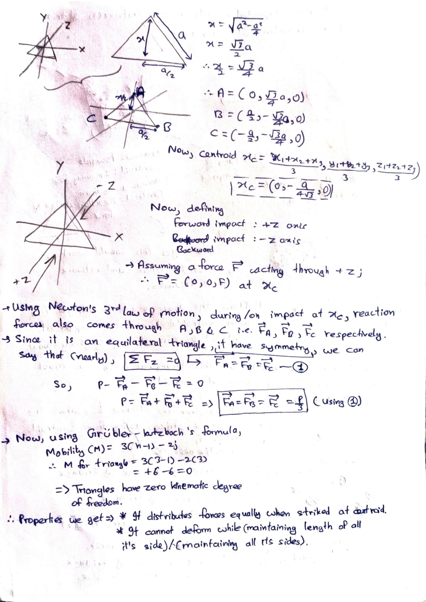
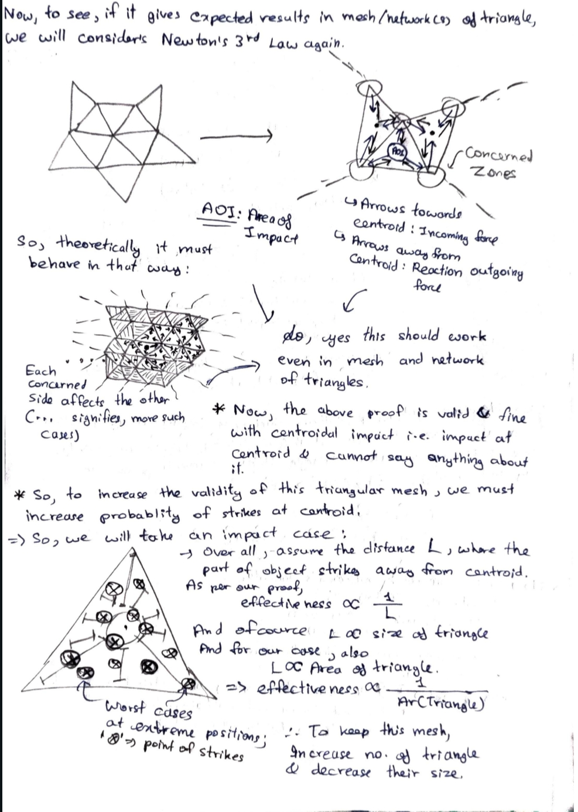
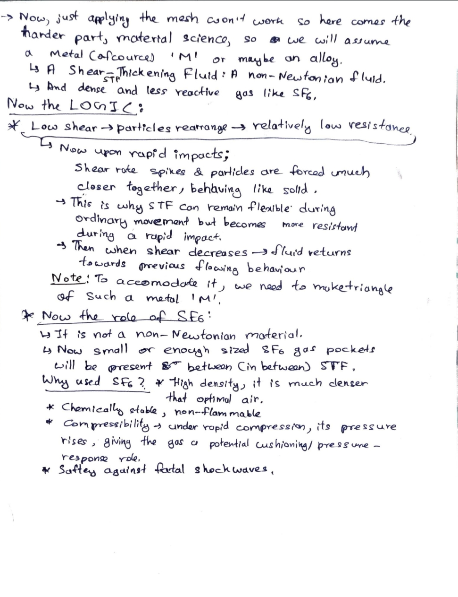

# Dynamic Compliance Mesh

## Concept Visualisation

An interactive breakdown of the DCM structure — a cutaway body view, four styling variants on the same mesh, and the cell behaviour at rest vs. under impact.

GitHub strips scripts from Markdown and raw HTML previews so that the file won't render inline on this page. Scroll to the bottom and click Open visualization.

## Research & Development Notes

Original handwritten pages documenting the development of the Dynamic Compliance Mesh. I used ChatGPT to generate images for the early concept renders.

### Page 1

### Page 2

### Page 3

NOTE: If you are thinking that I am just sitting frozen for validation, then you are wrong, as there is nothing much left to do; if I did, it would be an "in-air talk", so this is the peak theory limit
and now needs practical performance to develop it further
**[Open the visualisation](https://htmlpreview.github.io/?https://github.com/saturdayisnotsunday/DynamicComplianceMesh/blob/main/dcm-visual.html)**

For more work, visit: [EMULATOR](https://github.com/saturdayisnotsunday/EMULATOR)

[Photonic Processing Unit](https://github.com/saturdayisnotsunday/Photonic-Processing-Unit)
